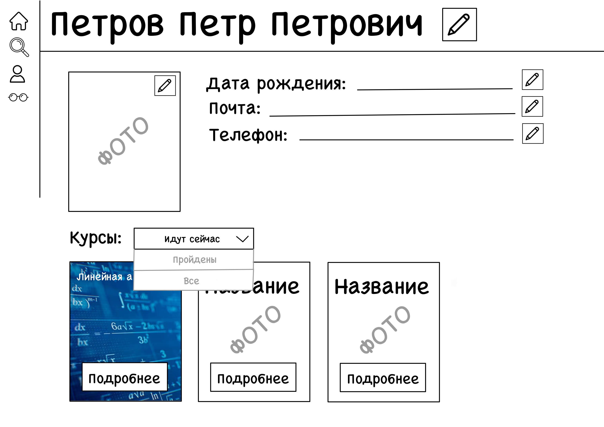
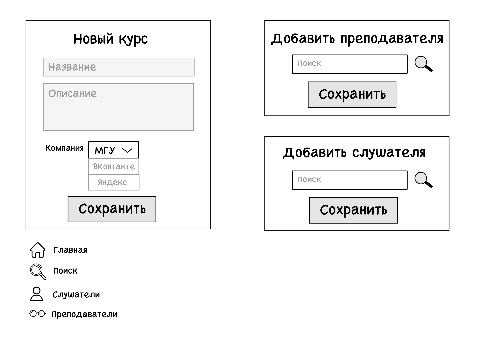

# Технологический практикум (6 семестр)
## Учебный центр

### Главная страница
* Карточки компаний, которые предоставляют свои обучающие курсы, их названия, логотипы/фотографии
* Кнопка на карточке "Курсы" переводит нас на страницу с курсами данной компании

---
### Страница компании
* Шапка страницы с названием компании, логотипом/фотографией, краткая информация о компании, ее адрес и контакты
* Список курсов данной компании в виде карточек
* Карточка курса с названием курса, тематической фотографией и двумя кнопками
* Кнопка подробнее перебрасывает на страницу данного курса
* Кнопка "мусорная корзина" удаляет данный курс из базы
* Кнопка со знаком + открывает форму по добавлению нового курса в базу (см. далее)

---
### Страница курса
* Шапка страницы с названием курса, тематической фотографией и названием компании
* Кнопка "карандаш" в шапке страницы включает режим редактирования информации, можно изменить название курса и компанию
* Описание курса - краткая информация о курсе, кнопка "карандаш" так же дает возможность редактирования информации
* Список преподавателей курса: фотографии и ФИО. На ФИО можно нажать и попасть на страницу данного преподавателя, так же кнопка "мусорная корзина" удаляет данного преподавателя с курса. Кнопка со знаком + открывает окно по добавлению преподавателя в курс (см. далее)
* Расписание: в выпадающем списке возможность выбора периода времени, за которое можно посмотреть расписание курса, кнопка "карандаш" позволяет отредактировать дату, время, аудиторию и преподавателя занятия
* План курса - список тем, которые будут проходиться на курсе, так же кнопка "карандаш", позволяющая отредактировать этот план
* Кнопка со знаком + открывает форму по добавлению нового слушателя на курс (см. далее)
* Список слушателей - список студентов, записанных на данный курс, выпадающий список для выбора сортировки, поиск по слушателям, кнопка "мусорная корзина" позволяет удалить студента с курса, при нажатии на ФИО идет перебрасывание на страницу данного слушателя

---
### Страница с преподавателями
* Карточки с фотографиями и ФИО преподавателей
* На ФИО можно нажать и попасть на страницу данного преподавателя, так же кнопка "мусорная корзина" удаляет данного преподавателя из базы.
* Можно выбрать сортировку в выпадающем списке, а так же фильтр по компаниям и поиск нужного преподавателя
* Кнопка со знаком + открывает форму по добавлению нового преподавателя в базу (см. далее)

---
### Личная страница преподавателя
* ФИО преподавателя в шапке страницы, кнопка "карандаш" позволяет редактировать ФИО
* Фотография, образование, компания и контакты, кнопка "карандаш" также позволяет редактировать информацию
* Слайдер с курсами, на которых данный преподаватель ведет занятия, кнопка "подробнее" перекидывает на страницу данного курса
* Расписание: в выпадающем списке возможность выбора периода времени, за которое можно посмотреть расписание данного преподавателя

---
### Страница со слушателями
* Карточки с фотографиями и ФИО слушателей
* На ФИО можно нажать и попасть на страницу данного слушателя, так же кнопка "мусорная корзина" удаляет данного преподавателя из базы.
* Можно выбрать сортировку в выпадающем списке, а также поиск нужного слушателя
* Кнопка со знаком + открывает форму по добавлению нового слушателя в базу (см. далее)

---
### Личная страница слушателя
* ФИО слушателя в шапке страницы, кнопка "карандаш" позволяет редактировать ФИО
* Фотография, дата рождения, почта и телефон, кнопка "карандаш" также позволяет редактировать информацию
* Курсы, на которые данный слушатель записан, кнопка "подробнее" перекидывает на страницу данного курса, с помощью выпадающего списка можно выбрать курсы, которые уже пройдены данным студентом или которые идут в настоящий момент
* Расписание: в выпадающем списке возможность выбора периода времени, за которое можно посмотреть расписание данного слушателя

---
### Формы для добавления преподавателя и слушателя в базу
* Открываются со страницы с преподавателями и страницы со слушателями соотвественно, при нажатии на кнопку с плюсом
* Поля для преподавателя: ФИО, компания, телефон и почта
* Поля для слушателя: ФИО, дата рождения, телефон и почта
* Кнопка "сохранить" сохраняет информацию и добавляет пользователя в базу

---
### Формы для добавления курса в базу, преподавателя и слушателя в курс, меню
* Форма для добавления курса в базу открывается со страницы компании при нажатии на кнопку с плюсом
* Поля для курса: название, компания и описание
* Кнопка "сохранить" сохраняет информацию и добавляет курс в базу
* Окна "добавить преподавателя" и "добавить слушателя" открываются со страницы курса при нажатии на кнопку с плюсом, можно найти нужного пользователя в базе, а кнопка "сохранить" сохраняет информацию и добавляет пользователя в курс
* Меню: при наведении на иконки слева страницы, открываются названия: "дом" - главная страница, "лупа" - поиск, "человек" - слушатели, "очки" - преподаватели, при нажатии переходит на соотвествующую страницу
